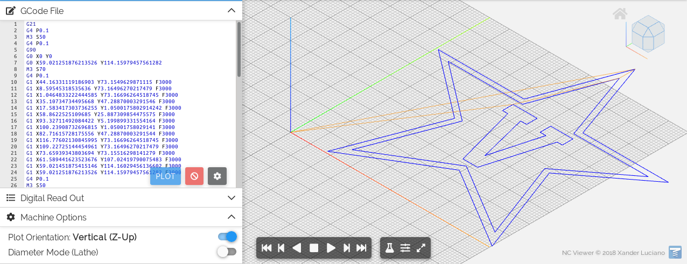

# svg2gcode


[](https://codecov.io/gh/sameer/svg2gcode)

Convert any SVG 1.1 path to gcode for a pen plotter, laser engraver, etc.

## TODO
- [ ] Biarc interpolation (G2/G3 instead of many G1)
- [ ] Sort paths by distance to reduce G0 distances
- [ ] Comments in GCode input
- [ ] 
## Known bugs/issues
- [ ] Smooth curves should not use the control point when the previous curve is not of the same type (quadratic -> smooth cubic, cubic -> smooth quadratic)
    - This is just a nit, it shouldn't matter if the SVG is correct

## Demonstration

### Input

```bash
cargo run --release -- examples/Vanderbilt_Commodores_logo.svg --off 'M4' --on 'M5' -o out.gcode
```


### Output, rendered at [https://ncviewer.com]()

```bash
cat out.gcode
```



### Real-world use on a Prusa Mini+

A [Prusa Mini+](https://shop.prusa3d.com/en/3d-printers/994-original-prusa-mini.html) was set up with a [pen plotter attachment](https://github.com/sameer/models/wiki#prusa-mini-plotter).
The `Vanderbilt_Commodores_logo.svg` and `moore.svg` examples were plotted on the same page.

```bash
cargo run --release -- --begin 'G0 Z10 G28 M201 X1250 Y1250 Z400 M203 X400 Y400 Z24 M205 X8.00 Y8.00 Z2.00 M107 G0 Z10 G0 X0 Y0 G0 Z1' --end 'G0 Z10' --on 'G0 Z1' --off 'G0 Z3' --origin 0,34 examples/Vanderbilt_Commodores_logo.svg -o out.gcode --feedrate 3000
```


## FAQ / Interesting details

* Use a 3D printer for plotting: (thanks @jeevank for sharing this) https://medium.com/@urish/how-to-turn-your-3d-printer-into-a-plotter-in-one-hour-d6fe14559f1a

* Convert a PDF to GCode: follow [this guide using Inkscape to convert a PDF to an SVG](https://en.wikipedia.org/wiki/Wikipedia:Graphics_Lab/Resources/PDF_conversion_to_SVG#Conversion_with_Inkscape), then use it with svg2gcode

* Are shapes, fill patterns supported? All objects can be converted to paths in Inkscape with `Object to Path` for use with this program. Not sure how practical fill patterns would be -- if you have ideas, feel free to open as issue or a PR.

* What about a generic PPD driver for using a plotter as a printer? I thought about doing something like this where you package ghostscript + inkscape + svg2gcode but that would take a lot of time

## Reference Documents

* [W3 SVG2 Specification](https://www.w3.org/TR/SVG/Overview.html)
* [CSS absolute lengths](https://www.w3.org/TR/css-values/#absolute-lengths)
* [CSS font-relative lengths](https://www.w3.org/TR/css-values/#font-relative-lengths)
* [CSS compatible units](https://www.w3.org/TR/css-values/#compat)
* [RepRap G-code](https://reprap.org/wiki/G-code)
* [G-Code and M-Code Reference List for Milling](https://www.cnccookbook.com/g-code-m-code-reference-list-cnc-mills/)
