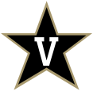

# svg2gcode

[](https://travis-ci.com/sameer/svg2gcode)

Convert any SVG 1.1 path to gcode for a pen plotter, laser engraver, etc.

## TODO
- [x] Support all path variants
- [x] Support group and path transforms
- [ ] Biarc interpolation (G2/G3 instead of many G1)
- [x] Px, pc, in to mm
- [x] Configurable DPI for px/pc to mm
- [ ] Sort paths by distance to reduce G0 distances
- [x] Configurable start/end sequence
- [ ] Comments in GCode input
- [ ] Rustdocs
- [ ] End-to-end tests

## Known bugs & whether fixed
- [ ] Smooth curves should not use the control point when the previous curve is not of the same type (quadratic -> smooth cubic, cubic -> smooth quadratic)
    - This is just a nit, it shouldn't matter if the SVG is correct
- [x] Image coordinates mirrored in the y-axis because SVGs uses upper left corner as (0,0) while GCode uses lower left as (0,0)
- [x] Close path command connects back to (0.0, 0.0) instead of the last move
- [ ] Ellipse paths are dubious -- large_arc, sweep may need to be inverted


## Demonstration

### Input

```bash
cargo run --release -- examples/Vanderbilt_Commodores_logo.svg --off 'M4' --on 'M5' -o out.gcode
```



### Output, rendered at [https://ncviewer.com]()

```bash
cat out.gcode
```


## FAQ / Interesting details

* Can I convert a PDF to gcode? Yes! Follow [this guide using Inkscape to convert a PDF to an SVG](https://en.wikipedia.org/wiki/Wikipedia:Graphics_Lab/Resources/PDF_conversion_to_SVG#Conversion_with_Inkscape)

* Are shapes, fill patterns supported? All objects can be converted to paths in Inkscape with `Object to Path` for use with this program. Not sure how practical fill patterns would be -- if you have ideas, feel free to open as issue or a PR.

* What about a generic PPD driver for using a plotter as a printer? I thought about doing something like this where you package ghostscript + inkscape + svg2gcode but that would take a lot of time

## Reference Documents

* [W3 SVG2 Specification](https://www.w3.org/TR/SVG/Overview.html)
* [RepRap G-code](https://reprap.org/wiki/G-code)
* [G-Code and M-Code Reference List for Milling](https://www.cnccookbook.com/g-code-m-code-reference-list-cnc-mills/)
